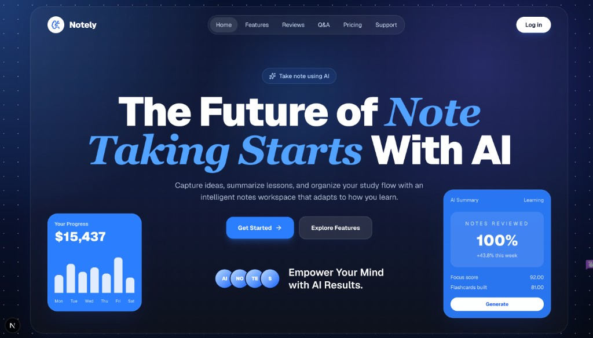
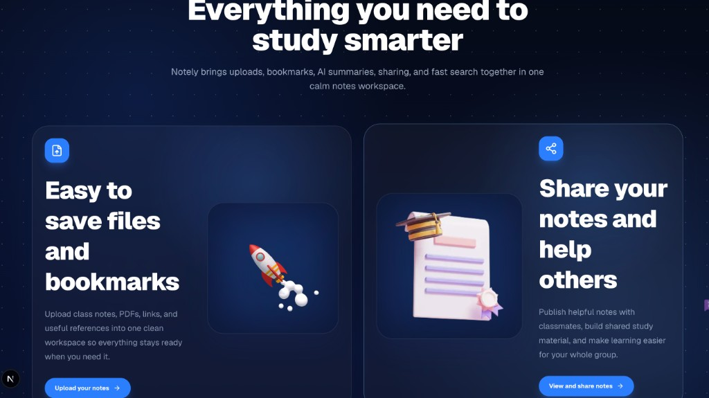
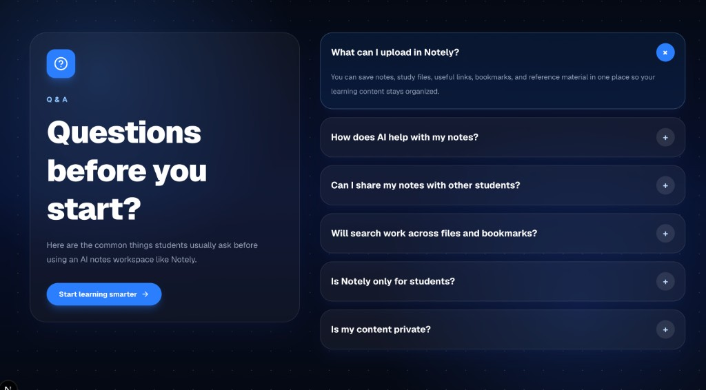
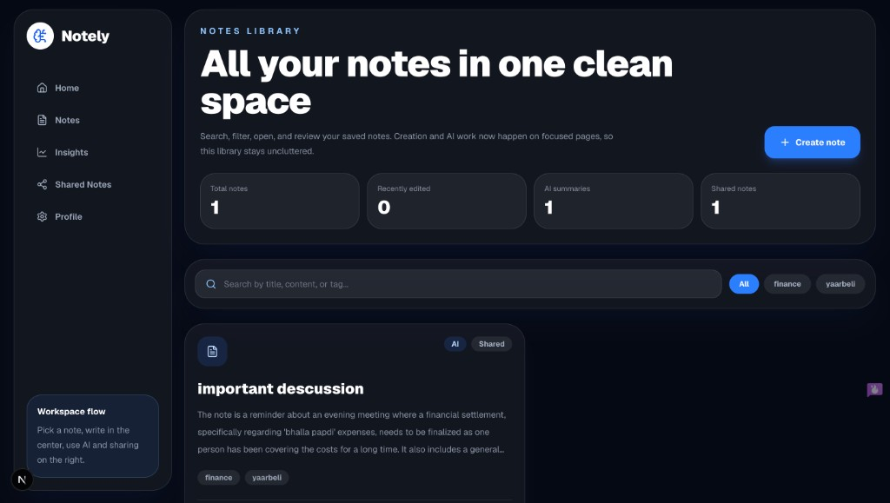
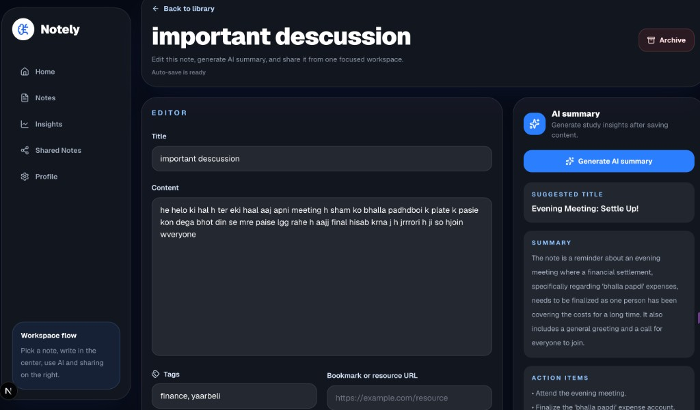
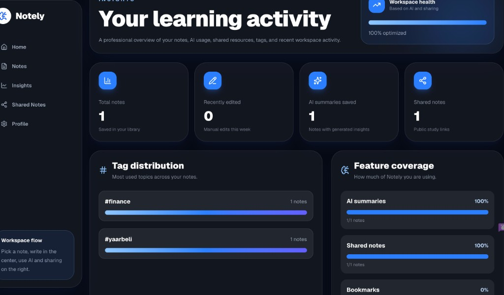
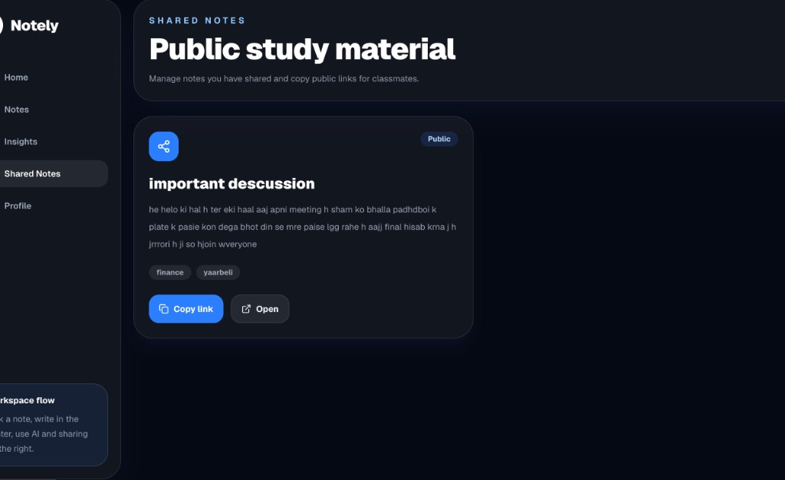

# Notely - Collaborative AI Notes Workspace

Notely is a full-stack AI notes workspace built for the Peblo Full Stack Developer Challenge. It lets users create and manage notes, organize them with tags, generate AI summaries and action items, search/filter their workspace, share public notes, and view productivity insights.

## Repository

GitHub: [https://github.com/Hemant-14942/Notely](https://github.com/Hemant-14942/Notely)

The repository contains both the frontend and backend source code, setup instructions, environment examples, screenshots, and sample AI output for review.

## Demo Video

[Demo video (Google Drive)](https://drive.google.com/file/d/1WehI71_mQqw3158w_2udMao9VbNAjCcc/view?usp=sharing)

## Features

- Authentication with signup, login, protected dashboard pages, JWT sessions, and hashed passwords.
- Notes workspace with create, edit, archive, tags, debounced auto-save, and optional resource/bookmark URLs.
- AI note insights using Google Gemini: summary, action items, and suggested title.
- Notes library with keyword search and tag filtering.
- Public sharing with generated share links and a clean public note page.
- Productivity insights dashboard with note stats, tag distribution, AI usage, shared notes, bookmarks, and recent activity.
- Modern responsive UI with dark SaaS styling.

## Tech Stack

- Frontend: Next.js 16, React 19, TypeScript, Tailwind CSS, Lucide icons.
- Backend: Node.js, Express 5, TypeScript, MongoDB/Mongoose.
- Auth: JWT, bcrypt password hashing.
- AI: Google Gemini via `@google/genai`.

## Project Structure

```txt
.
├── backend
│   ├── src
│   │   ├── controllers
│   │   ├── models
│   │   ├── routes
│   │   ├── services
│   │   ├── validators
│   │   └── server.ts
│   └── .env.example
├── frontend
│   ├── src
│   │   ├── app
│   │   ├── assests
│   │   └── lib
│   └── .env.example
├── docs
│   └── screenshots
└── README.md
```

## Environment Variables

Create `backend/.env` from `backend/.env.example`:

```env
NODE_ENV=development
PORT=5000
API_PREFIX=/api/v1
CLIENT_URL=http://localhost:3000
MONGODB_URI=your_mongodb_connection_string
JWT_SECRET=replace_with_a_secure_secret
JWT_EXPIRES_IN=7d
LLM_API_KEY=your_google_gemini_api_key
```

Create `frontend/.env.local` from `frontend/.env.example`:

```env
NEXT_PUBLIC_API_URL=http://localhost:5000/api/v1
```

Do not commit real `.env` files. Only `.env.example` files should be committed.

## Setup Instructions

Install backend dependencies:

```bash
cd backend
npm install
```

Install frontend dependencies:

```bash
cd frontend
npm install
```

Run backend:

```bash
cd backend
npm run dev
```

Run frontend:

```bash
cd frontend
npm run dev
```

Open the app at [http://localhost:3000](http://localhost:3000).

## Validation Commands

Frontend:

```bash
cd frontend
npm run lint
npm run build
```

Backend:

```bash
cd backend
npm run typecheck
npm run build
```

## API Overview

Base URL: `http://localhost:5000/api/v1`

Auth:

- `POST /auth/register`
- `POST /auth/login`

Notes:

- `GET /notes`
- `POST /notes`
- `GET /notes/:id`
- `PATCH /notes/:id`
- `DELETE /notes/:id`
- `POST /notes/:id/generate-summary`
- `POST /notes/:id/share`
- `GET /notes/shared`

Insights:

- `GET /insights`

Public sharing:

- `GET /shared/:shareId`

## Main User Flow

1. User signs up or logs in.
2. User creates a note from `/notes/new`.
3. User opens the note detail page and edits content/tags/resource URL.
4. User generates AI summary, action items, and suggested title.
5. User shares the note and gets a public link.
6. User views insights for notes, tags, AI usage, shared notes, bookmarks, and recent activity.

## Auto-Save Notes

Notely uses debounced auto-save on the note detail page. When a user edits the title, content, tags, or resource URL, changes are saved automatically after a short pause. The manual save button remains available as a fallback, and AI summary generation saves any pending edits before sending content to the AI service.

## Sample AI Output

Input note:

```txt
Discussed the landing page polish, dashboard notes flow, and public sharing.
Need to finish README, add env examples, record demo video, and test AI summary generation.
```

Expected AI output:

```json
{
  "summary": "The note covers final polish tasks for the notes workspace, including landing page improvements, dashboard flow, public sharing, README updates, environment examples, demo recording, and AI testing.",
  "action_items": [
    "Finish README documentation",
    "Add environment example files",
    "Record demo video",
    "Test AI summary generation",
    "Verify public sharing flow"
  ],
  "suggested_title": "Final Submission Checklist"
}
```

## Screenshots

### Landing Page



### Features Section



### Q&A Section



### Notes Library



### Note Detail With AI Summary



### Insights Dashboard



### Shared Notes



## Demo Video Checklist

Show these flows in a 5-10 minute walkthrough:

- Signup/login
- Create and edit note
- Search and filter notes
- Generate AI summary/action items/suggested title
- Share note and open public link
- View insights dashboard

## Security Notes

- Passwords are hashed with bcrypt.
- Protected APIs require JWT bearer tokens.
- Real secrets should remain in local `.env` files only.
- `.gitignore` excludes real environment files and build artifacts.

## Future Improvements

- Markdown preview.
- File/PDF upload.
- Dedicated resources/bookmarks page.
- Apply suggested AI title button.
- Realtime collaboration.
- Optimistic UI updates.
- Automated tests.
